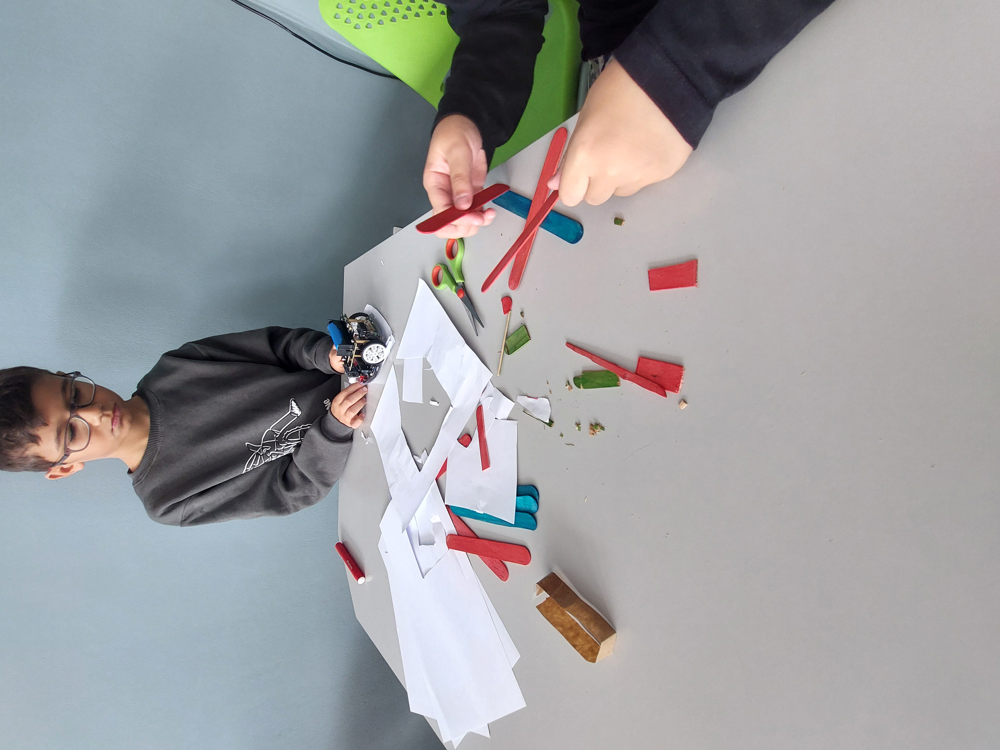
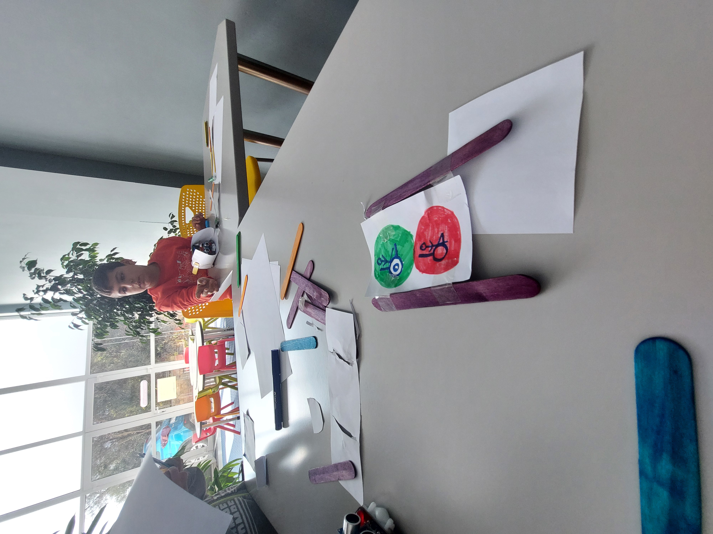
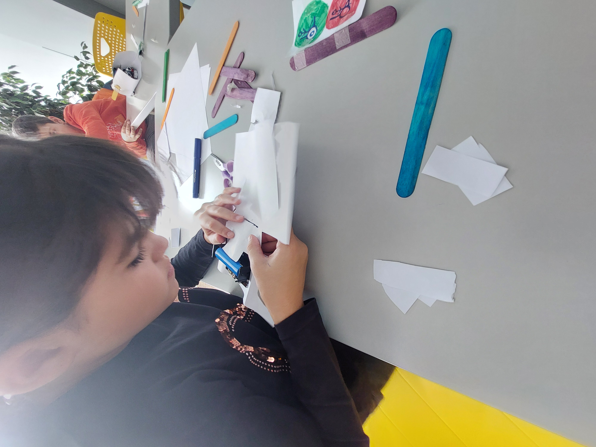
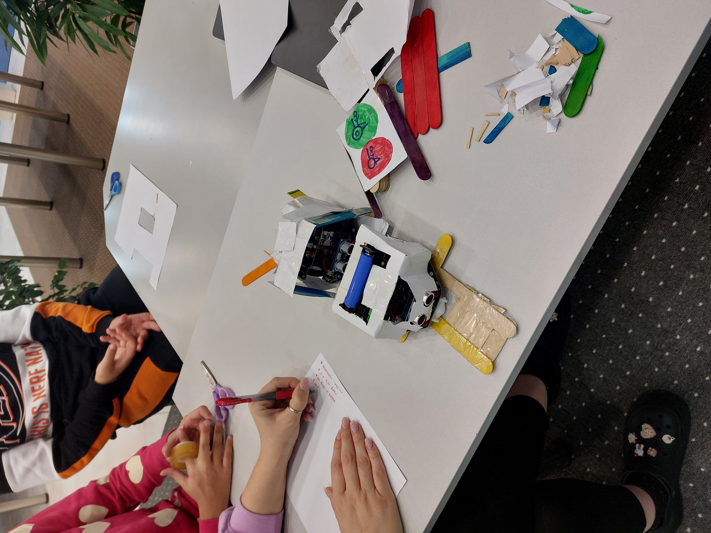
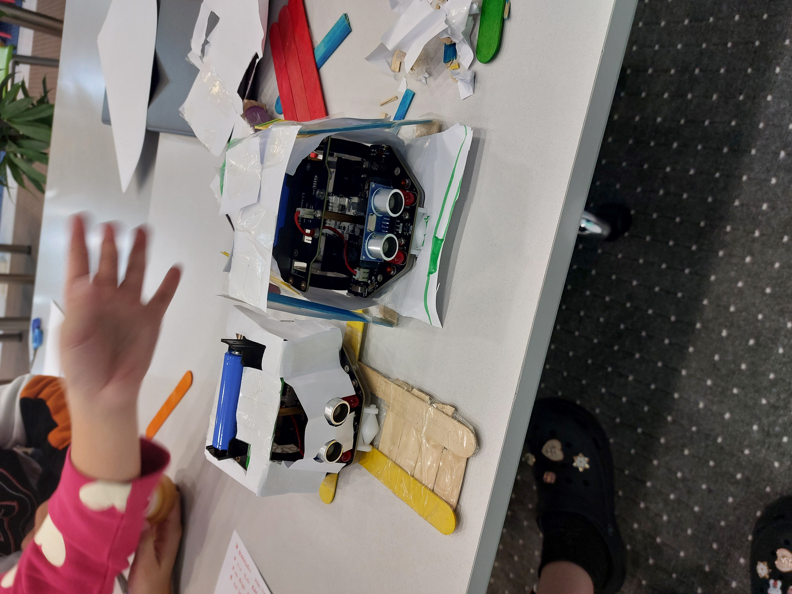

## Παρουσίαση RobotOver
Την παρουσίαση του ρομπότ μπορείτε να την βρείτε [εδώ](https://bit.ly/40HiauG).

## Σχεδιασμός Ρομπότ
Σημαντικό μέρος της διαδικασίας υλοποίησης της ιδέας μας αποτέλεσε ο σχεδιασμός του της βάσης επέκτασης λειτουργιών του ρομπότ.
Τα παιδιά αρχικά αποτύπωσαν στο χαρτί ιδέες για το πως θα μπορούσε να μοιάζει το ρομπότ, πιθανά σημεία της πόλης που θα μπορούσε να κινηθεί, τα παιχνίδια που θα φαίνονται στο πλέγμα LEDs του micro:bit.

Στην συνέχεια ακολούθησε συζήτηση μεταξύ τους ώστε να συμφωνήσουν στα βασικά χαρακτηριστικά. Τέλος τα παιδιά με την χρήση χαρτιών, γλωσσοπίεστρων και μαρκαδόρων σχημάτισαν το καλούπι της βάσης το οποίο αποτέλεσε το βασικό σχέδιο για την τρισδιάστατη εκτύπωση.

 ## Υλικά που χρησιμοποιήσαμε

 Για την υλοποίηση της ιδέας μας χρησιμοποιήσαμε:
 - Σαν βάση 1 ρομπότ Maqueen,
 - 2 micro:bit, το ένα ως εγκέφαλο του ρομπότ και το άλλο ως την εφαρμογή κινητών για επικοινωνία του χρήστη με το ρομπότ,
 - χαρτιά, κόλλες, γλωσσοπίεστρα, σελοτεϋπ,
 - πλαστικό PLA για την τρισδιάστατη εκτύπωση